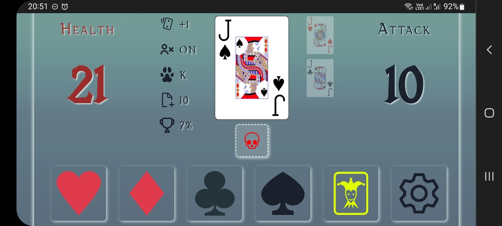

# Regicide Companion Plus

An app to assist you during your Regicide boardgame plays. This is not the official app but it includes more options and quality of life improvements.
Try it online: [Regicide Companion Plus](regicide-plus.netlify.app)

## Why this app?

Hi, I'm Guillaume aka Poukame. I created this app because I love playing Regicide with my friends or online.
In the online version on BGA, there are some interesting options to increase or decrease the difficulty of the game.

I found them interesting and was disappointed by the official app not proposing them. So I decided to create one that would include options for more challenging plays and some quality of life improvements.

## Screenshot and GIF

## Features

Everything from the official companion app plus:

- Choose from advance options: enemies health, enemy attack, max combo card, max animal companion card...
- Progress percentage that allows you to compare you score in the most challenging battles,
- Actions reminders (heal, draw cards, perfect kill...) so you don't forget or need to calculate things,
- Use the app in landscape or portrait mode,
- Install the app on your computer or phone and acts like a native app with OFFLINE mode

## Source Code

[GitHub](https://github.com/Poukame/regicide-plus)

Built using:

- [React](https://github.com/facebook/react)
- [Chakra UI](https://github.com/chakra-ui/chakra-ui)
- [Vite](https://github.com/vitejs/vite) and [VitePWA](https://github.com/antfu/vite-plugin-pwa)
- [Iconify](https://icon-sets.iconify.design/)

## Credits

Thanks to [Badgers From Mars](https://www.badgersfrommars.com/regicide) for Regicide which is an awesome game.

[Link to the rulebook](https://www.badgersfrommars.com/assets/RegicideRulesA4.pdf) (because there is always this moment where we have a doubt 😉)

### Fonts

Vecna by [fontspace.com](https://www.fontspace.com/vecna-font-f20510)

### Musics

"Viking Intro" and "Celtic Ambiance" by Alexander Nakarada ([www.serpentsoundstudios.com](https://www.serpentsoundstudios.com/) Licensed under Creative Commons BY Attribution 4.0 License https://creativecommons.org/licenses/by/4.0/

### Sound Fx

Sound effects obtained from [www.zapsplat.com](www.zapsplat.com)

### Playing Cards

Generated thanks to [www.me.uk/cards/makeadeck.cgi](www.me.uk/cards/makeadeck.cgi)
